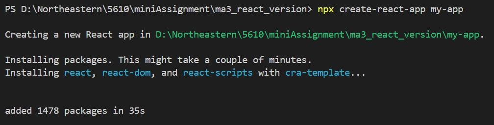
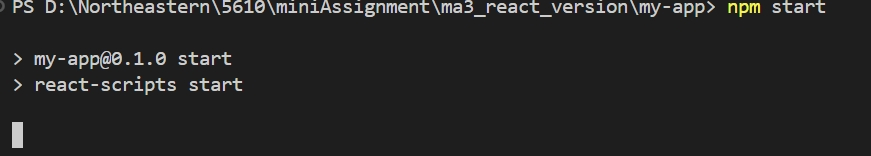
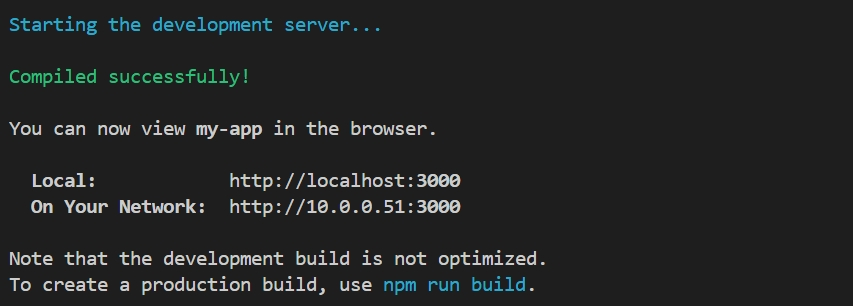

# CS5610_React_ma3

As requested, I re-completed mini assignment 3 using React components: CSS+

*Type `npx create-react-app my-app` in the terminal to create a react app*

*After finishing the code writing, enter the `npm start` command in the terminal to start the App.*

*Complete Build.*
